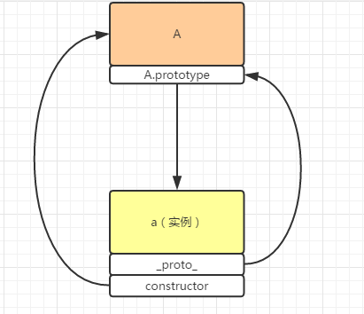

# <center>继承方式</center>

- 构造函数继承
  - 绑定方式继承
  - prototype 原型继承
  - 实例继承（父对象实例、空对象中介实例）
  - 拷贝继承（jquery 是通过 deepCopy 深拷贝实现继承）
- 非构造函数的继承
  - object()
  - 浅拷贝
  - 深拷贝

```javascript
function Animal() {
  this.species = "动物";
  this.eat = function() {
    console.log("eat something!");
  };
}
function Cat(name, color) {
  this.name = name;
  this.color = color;
}
```

**构造函数继承**

1. 通过使用 apply、call 改变函数上下文 this（无法继承原型链内容）

```javascript
function Cat(name, color) {
  Animal.apply(this, arguments);
  this.name = name;
  this.color = color;
}
var cat1 = new Cat("cat1", "black");
alert(cat1.species); //‘动物’
console.log(cat1.eat()); //‘eat something!’
```

2.prototype 方式

```javascript
Cat.prototype = new Animal();
Cat.prototype.constructor = Cat;
var cat2 = new Cat("cat2", "black");
alert(cat2.species); // '动物'
```

第一步：将 cat.prototype 只想 Animal 的一个实例，相当于给 cat 的 prototype 原型重新赋值，这时原型指向 Animal 的实例
第二步作用：因为 prototype 原型都会有一个 constructor 属性，指向他的构造函数，如果没有第一步 Cat.prototype = new Animal(),这是的 contructor 指向的是 Cat,当执行了第一步，重新为原型 prototype 赋值后，这是的 constructor 指向是的构造函数 Animal。

`alert(Cat.prototype.constructor === Animal) //true`

此外每一个 new 出来的实例，都有一个 constructor 属性，指向的是他的构造函数，默认的会调取 prototype 上的 constructor 属性。

`alert(cat2.constructor === Cat,prototype.constructor) //true`
`alert(cat2.constructor === Animal) //true`

这样会导致继承链的混乱,（cat1 的构造函数应该是 Cat）所以需要重新复制，也就是第二步的意思。**这个很重要，编程时需要遵守，如果修改了 prototype 对象，下一步必须为 prototype 增加 constructor 属性，并指回原来的构造函数**

```javascript
o.prorotype = {};
o.prorotype.constructor = o;
```

**弊端：**没办法实现多次继承，如果父类存在`引用类型`属性，比如[]、fun()、obj。子类的实例公用（共享）该属性，其中一个修改了该属性，则会造成所有的实例都修改

```javascript
var cat1 = new Cat("猫1", "黑色");
var cat2 = new Cat("猫2", "白色");
cat1.alive; // ["water", "air"]
cat2.alive; // ["water", "air"]
cat1.alive.push("food");
cat1.alive; // ["water", "air", "food"]
cat2.alive; // ["water", "air", "food"]
```

3.直接继承 prorotype
相当于上面的改进，跳过 Animal()实例，需要把所有的属性存放在原型 prototype 上。同样存在上面相同的问题。

```javascript
function Animal(){};
Animal.prorotype.species = '动物'；
Animal.prorotype.eat = function(){
    console.log('eat something!')
}
```

然后将 Cat 的 prototype 指向 Animal.prorptype

```javascript
Cat.prototype = Animal.prototype;
Cat.prototype.constructor = Cat;
var cat3 = new Cat("cat3", "red");
alert(cat3.species); //‘动物’
```

与之前相比，性能会提升，不需要执行和建立 Animal 的实例了，比较省内存。也存在**缺点：**因为 Cat.prototype 和 Animal.prorotype 指向的是同一个对象，如果修改了 Cat.prototype。Animal 的 prototype 也会被修改

```
Cat.prototype.constructor = Cat;
alert(Animal.prototype.constructor === Cat) //true
```

4.空对象作为中介
结合 2、3 两种方式

```javascript
var F = function() {};
F.prototype = Animal.prototype;
Cat.prototype = new F();
Cat.prototype.constructor = Cat;
```

空对象几乎不占内存，这是修改 Cat 的 prototype 不会影响到 Animal 的 prototype

`alert(Animal.prototype.constructor===Animal)`// true
封装为一个公用方法

```javascript
function Extend(child, parent) {
  var F = function() {};
  F.prototype = parent.prototype;
  child.prototype = new F();
  child.prototype.constructor = child;
}
Extend(Cat, Animal);
var cat4 = new Cat("cat4", "write");
alert(cat4.species); // '动物'
```

5.拷贝继承
简单理解就是把父类的所有属性和方法都一一拷贝到子类对象，实现继承。
首先把 Animal 的所有不变属性都放在 prototype 上

```javascript
function Animal(){}
Animal.prototype.species = '动物'；
Animal.prototype.eat = function (){
    console.log('eat something!')
}
```

然后写一个拷贝的方法

```javascript
//此情况下child没有自己的属性或方法绑在原型上
function Extend(child, parent) {
  var p = parent.prototype;
  var c = child.prototype;
  for (var i in p) {
    c[i] = p[i];
  }
}
```

---

上述原理都没有有效的避免不能实例化多个的问题，一般采用混合模式实现继承 6.混合模式
结合构造函数绑定方式，和原型继承方式。

```javascript
function Animal() {
  this.species = "动物";
  this.eat = function() {
    console.log("eat something!");
  };
  this.alive = ["walter", "air"];
}
Animal.prototype.run = "跑";
function Cat(name, color) {
  Animal.apply(this, arguments);
  this.name = name;
  this.color = color;
}
Cat.prototype = new Animal();
Cat.prototype.constructor = Cat;
var cat6 = new Cat("cat6", "yellow");
var cat7 = new Cat("cat7", "blue");
console.log(cat6.alive); //['walter','air']
console.log(cat7.alive); //['walter','air']
cat6.alive.push("food");
console.log(cat6.alive); //['walter','air','food']
console.log(cat7.alive); //['walter','air']
```

通过 apply 绑定，将父类的属性方法都添加到子类中，prototype 指向父类的实例，继承父类原型上的属性方法，
**_子类的实例在调用某一个属性时，会先在自己的构造函数中寻找，如果找到则采用该构造函数中的属性方法，如果没找到则会通过 prototype 向上找，一直找到最顶层对象 Object。_**
上面通过 apply 的方式已经把 Animal 构造函数中的属性方法全部复制到 Cat 的构造函数中，此时`alive`这些属性为 Cat 构造函数自身的属性方法。

## 非构造函数继承

对象就为非构造函数,一个‘中国人’的对象，和一个‘医生’的对象

```
var Chinese = {
    nation:'中国'
}
var Doctor = {
    career:'医生'
}
```

医生继承中国人，得到’中国医生‘对象
1.object()
object 函数来操作 json,objec 函数作用是，把子对象的 prototype 指向父对象，从而使子对象和父对象连接起来

```javascript
function object(parent) {
  var F = function() {};
  F.prototype = parent;
  return new F();
}
var Doctor = object(Chines);
Doctor.career = "医生";
alert(Doctor.nation); //‘中国’
```

2.浅拷贝
存在引用类型数据情况下，多次继承会存在共享问题

```javascript
function extendCopy(p) {
  var c = {};
  for (var i in p) {
    c[i] = p[i];
  }
  return c;
}
var doctor = extendCopy(Chines);
doctor.career = "中国";
alert(doctor.nation); //'中国'
```

3.深拷贝

```javascript
function extendDeepCopy(p) {
  if (typeof p === "object") {
    var result = p.constructor === "Array" ? [] : {};
    for (let i in p) {
      result[i] = typeof p[i] === "object" ? extendDeepCopy(p[i]) : p[i];
    }
  } else {
    var result = p;
  }
  return result;
}
```

##补充细节知识点
instanceof 和 constructor 异同点
两者都是判断一个实例对象是不是这个构造函数实力来的，这个实例对象是不是这个构造函数 new 出来的
constructor 更加严谨。例如 A 继承 B，B 继承 C，A 的实例用 instanceof 判断与 A、B、C 的关系都返回 true，constructor 本质是原型对象的属性，他指向创建当前实例的对象。
A 的实例会有一个**proto**属性，instanceof 是来判断实例的**proto**属性指向的是不是创建它的对象的原型存储的内存。会通过原型一次向上查找。

